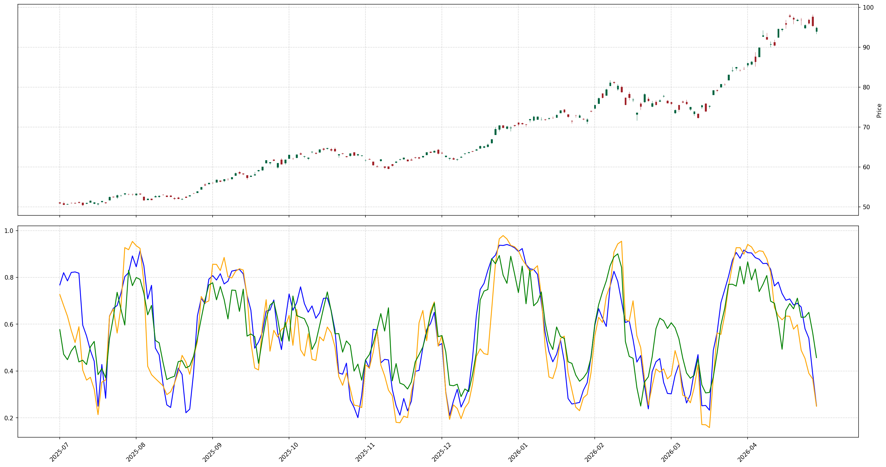

# Quant Swing Prediction

An LSTM-based trend prediction system for swing trading with feature engineering.
## 專案目標:
本專案是開發應用於 **短期波段交易(Short-term Swing Trading)** 的預測系統，核心目標是利用深度學習技術，從複雜與充滿雜訊的市場波動中篩選出 **極高勝率** 的短線進場點，解決一般投資者在短線操作時容易而誤判的問題。
## 核心設計理念:
本專案的開發邏輯並非追求頻繁交易，而是追求極低的 **犯錯率（False Alarm Rate）** 與高信心度的選點，從而達成「高期望值」的交易策略：
### 模型架構:
採用 **LSTM (Long Short-Term Memory)** 深度學習架構，由於股價具備強烈的時序依賴性，LSTM 擅長捕捉時間序列中的非線性特徵與短期動能轉折，比傳統技術指標更具備預測能力。
### 訓練穩健性:
為解決隨機初始化對模型收斂產生的不穩定影響，系統採用五次獨立訓練並取平均的機制，透過整合多次訓練結果，有效平滑模型對初始權重的依賴，提升預測輸出的穩定度。
### 特徵工程:
* 交易量動能:
計算當日成交量與 14 日均量的比值，判斷短期上漲是否具備實質資金支撐。
* 多方信心程度:
統計過去 14 日內紅棒出現的頻率，量化市場短期的多方慣性與心理偏向。
* 相對強弱強度:
衡量股價偏離均線的標準差倍數，藉此判斷動能的異常與否，識別具備統計意義的突破點。
* K 棒實體強度: 
計算 K 棒實體佔全日波動的比例，有效過濾上下影線過長的震盪盤。
### 多尺度視角:
為了捕捉不同市場週期下的價格慣性，系統引入了長、中、短期訓練結果整合機制，透過訓練多個不同時間維度的模型視角，系統能夠在維持短期動能捕捉的同時，兼顧長期趨勢的過濾，從而提高在不同盤勢下的適應性。
### 標籤邏輯:
本專案不採用簡單的「隔日漲跌」作為標籤，而是設計了更符合實戰穩定性的「波段濾波標籤」
* 核心公式：label = (未來3日收盤均價 > 14日均線×1.01) AND (未來第3日收盤價 > 14日均線×1.006)
* 設計理念：
  * 採用收盤價進行回測與標記，是因為接近盤後交易時價格波動相對穩定，能減少實務操作中的滑價誤差。
  * 增加 **未來第3日收盤價** 作為限制條件，是為了確保該進場點處於明確的上升趨勢中。

### 回測結果:

觀察與分析:
在實際趨勢發生前，指標已能捕捉到動能轉折並先行反映，這對於短線波段交易中的布局至關重要，能有效爭取更好的成本優勢。
 
## 模組化設計:
專案採工業級模組化架構，展現良好的程式維護性：
* `config.py`           ： 系統參數與設定檔
* `main.py`             ： 程式執行入口
* `model.py`            ： LSTM 模型神經網路架構
* `train_model.py`      ： 模型訓練邏輯
* `evaluate_model.py`   ： 系統評估與訊號產生

## 安裝與環境需求:
本專案開發環境基於 **Python 3.8+**，並使用以下核心套件：
* `FinMind`
* `PyTorch`
* `Pandas`
* `NumPy`
* `tqdm`
* `Matplotlib`
## 快速使用:
* 使用 `config.py` 抓取目標個股數據，預設支援 FinMind 資料源，可自由切換不同代號進行回測。
* 使用 `main.py` 進行預測或回測資料。
## 免責聲明:
本專案僅供學術研究與技術開發展示，不構成任何投資建議。
